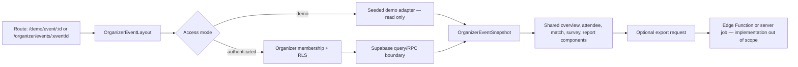

# Niah B2B Event Organizer Shell Specification

Status: implementation handoff
Audience: product, design, Lovable builders, and Supabase implementers
Primary persona: event organizer
Reference event: `evt-talktonics-2024`

## 1. Purpose

This document defines the B2B shell for an event organizer who needs to understand event participation, matchmaking activity, and attendee survey performance without managing the underlying event-production workflow.

The shell must let an organizer answer five questions quickly:

1. How many people registered and participated?
2. How many match recommendations and accepted introductions were created?
3. Where is engagement dropping off?
4. How many attendee surveys were completed, and what do they say?
5. What should the organizer do next?

## 2. Evidence and current repository boundary

### Verified GitHub state

- Repository: `https://github.com/jordanjayhays-cpu/niah-dashboard`
- Default branch: `main`
- The repository currently contains a single static page: `index.html`.
- `index.html` is a Madrid B2B market/research dashboard. It contains brand tokens, lead targets, competitor research, outreach copy, and an agent-network section.
- The repository does **not** currently contain a package manifest, application source directory, route definitions, Supabase client, or `/demo/event/[id]` component.

### Lovable runtime boundary

- Lovable project: `https://lovable.dev/projects/9eab0291-65d5-4f37-93a9-7969aa8c4393`
- Referenced runtime route: `/demo/event/[id]`
- Referenced demo URL: `/demo/event/evt-talktonics-2024`
- The preview is workspace-authenticated, and its application source is not present in the connected GitHub repository.

Therefore, the paths and component contracts below are the required implementation shell for the next Lovable-to-GitHub sync. They are not claims that those files already exist.

## 3. Scope

### In scope

- Event-organizer navigation and event context
- Read-only event overview
- Attendee engagement and matchmaking summaries
- Survey completion and response summaries
- Reports/export entry points
- Loading, empty, permission, stale-data, and error states
- Route, component, data, and Supabase boundaries

### Out of scope

- B2C/end-user authentication flows
- Payment or subscription integration
- Event creation or editing
- Survey-builder UI
- Speaker management
- Niah internal master-admin dashboard
- Backend API or Edge Function implementation
- Matchmaking algorithm implementation
- Points/rewards logic
- Mobile-specific layout specification
- Sending attendee communications

## 4. B2B buyer journey

1. **Enter demo or organizer workspace**
   The organizer opens `/demo/event/evt-talktonics-2024` or an authenticated event route. The shell resolves the event ID, organizer access, and event summary.

2. **Orient to event health**
   The overview presents event identity, status, date/location, freshness, and the most important metrics: participation, matches, accepted introductions, and survey completion.

3. **Diagnose engagement**
   The organizer follows the funnel from registered attendees to active participants, match recommendations, accepted introductions, and completed post-event surveys.

4. **Inspect operational detail**
   The organizer opens attendees, matches, or surveys to filter segments and identify low-engagement cohorts or incomplete actions.

5. **Review outcomes**
   The reports view summarizes match and survey outcomes and offers a safe export entry point.

6. **Choose a next action**
   Every page ends with one contextual recommendation, such as reviewing unmatched attendees, checking survey drop-off, or exporting the current report. Communications and campaign execution remain out of scope.

## 5. Route and file map

These are proposed paths for the next application-source sync.

| Route | Proposed page file | Purpose |
|---|---|---|
| `/demo/event/[id]` | `src/pages/demo/EventOrganizerDemoPage.tsx` | Seeded read-only demonstration of the complete organizer shell |
| `/organizer/events/[eventId]` | `src/pages/organizer/EventOverviewPage.tsx` | Organizer overview and engagement funnel |
| `/organizer/events/[eventId]/attendees` | `src/pages/organizer/EventAttendeesPage.tsx` | Attendee list, participation state, and segment filters |
| `/organizer/events/[eventId]/matches` | `src/pages/organizer/EventMatchesPage.tsx` | Match recommendations and introduction outcomes |
| `/organizer/events/[eventId]/surveys` | `src/pages/organizer/EventSurveysPage.tsx` | Survey completion, score summaries, and response themes |
| `/organizer/events/[eventId]/reports` | `src/pages/organizer/EventReportsPage.tsx` | Outcome summary and export entry points |

Shared shell and data modules:

| Proposed file | Responsibility |
|---|---|
| `src/layouts/OrganizerEventLayout.tsx` | Event context header, navigation, access boundary, page outlet |
| `src/components/organizer/EventHeader.tsx` | Event name, organizer, status, date, location, and freshness |
| `src/components/organizer/MetricCard.tsx` | Consistent KPI value, comparison, tooltip, and state handling |
| `src/components/organizer/EngagementFunnel.tsx` | Registered-to-survey conversion stages |
| `src/components/organizer/AttendeeTable.tsx` | Attendee rows, filters, sorting, and pagination |
| `src/components/organizer/MatchTable.tsx` | Match pair, score band, introduction status, and outcome |
| `src/components/organizer/SurveySummary.tsx` | Completion, score distribution, NPS, and themes |
| `src/components/organizer/OrganizerNextAction.tsx` | One evidence-based next-step recommendation |
| `src/lib/niah/organizer-types.ts` | UI-facing organizer/event contracts |
| `src/lib/niah/organizer-data.ts` | Supabase queries and demo-data adapter |
| `src/lib/niah/organizer-routes.ts` | Route constants and event-ID parsing |

## 6. Page specifications

### 6.1 Event organizer demo — `/demo/event/[id]`

Purpose: demonstrate the full shell without requiring production organizer access.

Required content:

- Event header: event name, organizer name, event status, date range, location, and timezone
- Demo indicator and seeded-data timestamp
- KPI row: registered attendees, active/checked-in attendees, match recommendations, accepted introductions, and survey responses
- Engagement funnel
- Match outcome preview
- Survey outcome preview
- Contextual next action

Interactions:

- Change the selected event when more than one demo event exists
- Open a KPI card to its detail route
- Hover or focus metric help text
- Filter previews by attendee segment when demo segments exist
- Navigate among overview, attendees, matches, surveys, and reports

Data flow:

1. Parse `id` from the route.
2. Resolve a seeded `OrganizerEventSnapshot` from the demo adapter.
3. Render the same components used by authenticated organizer routes.
4. Never write data from demo mode.

States:

- `loading`: skeleton header, KPI cards, and charts
- `ready`: complete seeded snapshot
- `not_found`: unknown demo event ID with a link to a known demo
- `error`: retry control and support reference

### 6.2 Event overview — `/organizer/events/[eventId]`

Purpose: provide a 30-second health check for one event.

Required content:

- Event identity and freshness
- KPI cards with current value and previous-period or target comparison
- Engagement funnel stages:
  - registered
  - checked in or active
  - match recommendations generated
  - introductions accepted
  - surveys completed
- Segment breakdown by ticket type, company type, or organizer-defined cohort
- One next-action recommendation

Interactions:

- Select comparison period or target when available
- Filter all overview modules by segment
- Open the detail page behind a KPI or funnel stage
- Clear filters

Data flow:

1. Layout verifies organizer membership for `eventId`.
2. Overview query returns one aggregated snapshot.
3. Segment filter updates query parameters without changing event context.
4. Query freshness is displayed; stale data remains visible with a warning.

### 6.3 Attendees — `/organizer/events/[eventId]/attendees`

Purpose: identify who participated and where engagement is incomplete.

Required columns:

- Attendee display name or privacy-safe identifier
- Organization and role, when permitted
- Registration/check-in status
- Profile completeness
- Match recommendations count
- Accepted introductions count
- Survey status
- Last activity timestamp

Interactions:

- Search by attendee or organization
- Filter by participation, match, introduction, and survey status
- Sort by engagement or last activity
- Open a read-only attendee detail drawer
- Export the filtered result when permission allows

States:

- Empty event: explain that no attendees are available
- Empty filter: preserve filters and offer clear-all
- Restricted fields: display privacy-safe substitutes instead of failing the page

### 6.4 Matches — `/organizer/events/[eventId]/matches`

Purpose: explain matchmaking volume and outcomes without exposing algorithm internals.

Required columns:

- Match identifier
- Attendee A and attendee B privacy-safe labels
- Organization pair
- Score band (`high`, `medium`, `low`) rather than raw model internals
- Recommendation timestamp
- Introduction status (`recommended`, `viewed`, `accepted`, `declined`, `expired`)
- Outcome status when captured

Interactions:

- Filter by score band, status, segment, and organization
- Sort by recommendation time or status
- Open a read-only match detail drawer
- Export the current result when permission allows

### 6.5 Surveys — `/organizer/events/[eventId]/surveys`

Purpose: show post-event response volume, satisfaction, and themes.

Required content:

- Eligible attendees
- Started responses
- Completed responses
- Completion rate
- Average score and/or NPS when the survey supports it
- Score distribution
- Response trend over time
- Top structured answers
- Privacy-safe qualitative themes

Interactions:

- Select a survey when multiple surveys belong to the event
- Filter by attendee segment and completion state
- Change the reporting period
- Export aggregate results
- Open a response detail only when organizer permissions and privacy policy allow it

### 6.6 Reports — `/organizer/events/[eventId]/reports`

Purpose: provide a compact outcome narrative and safe export entry point.

Required content:

- Participation summary
- Matchmaking summary
- Survey summary
- Data-freshness timestamp
- Applied filters
- Export format choices: CSV for tabular detail and PDF for aggregate summary

The shell may expose export controls, but export generation and storage are backend implementation work and remain out of scope for this document.

## 7. Component inventory

### `OrganizerEventLayout`

Props:

- `eventId: string`
- `mode: 'demo' | 'authenticated'`
- `children: ReactNode`

States: `resolving`, `ready`, `forbidden`, `not_found`, `error`.

### `EventHeader`

Props:

- `event: EventSummary`
- `freshness: DataFreshness`
- `mode: 'demo' | 'authenticated'`

States: loading skeleton, live, completed, draft, stale.

### `MetricCard`

Props:

- `label: string`
- `value: number | string`
- `comparison?: MetricComparison`
- `helpText: string`
- `state: 'loading' | 'ready' | 'empty' | 'stale' | 'error'`
- `onOpen?: () => void`

### `EngagementFunnel`

Props:

- `stages: FunnelStage[]`
- `selectedSegment?: string`
- `onStageOpen?: (stageId: string) => void`

States: loading, ready, empty, partial, stale.

### `AttendeeTable`

Props:

- `rows: OrganizerAttendeeRow[]`
- `filters: AttendeeFilters`
- `sort: TableSort`
- `page: PaginationState`
- `permissions: OrganizerPermissions`
- `onFiltersChange`, `onSortChange`, `onPageChange`, `onRowOpen`

States: loading, ready, empty-event, empty-filter, error.

### `MatchTable`

Props:

- `rows: OrganizerMatchRow[]`
- `filters: MatchFilters`
- `sort: TableSort`
- `page: PaginationState`
- `permissions: OrganizerPermissions`

States: loading, ready, empty, partial-outcomes, error.

### `SurveySummary`

Props:

- `summary: OrganizerSurveySummary`
- `selectedSurveyId: string`
- `selectedSegment?: string`
- `permissions: OrganizerPermissions`

States: loading, ready, no-survey, no-responses, insufficient-sample, error.

### `OrganizerNextAction`

Props:

- `action: OrganizerActionRecommendation`
- `onOpen: () => void`

States: ready, unavailable, dismissed.

## 8. UI-facing data contracts

```ts
type OrganizerEventSnapshot = {
  event: EventSummary;
  permissions: OrganizerPermissions;
  freshness: DataFreshness;
  metrics: OrganizerEventMetrics;
  funnel: FunnelStage[];
  segments: EventSegment[];
  matchSummary: OrganizerMatchSummary;
  surveySummary: OrganizerSurveySummary;
  nextAction: OrganizerActionRecommendation | null;
};

type EventSummary = {
  id: string;
  name: string;
  organizerName: string;
  status: 'draft' | 'live' | 'completed';
  startsAt: string;
  endsAt: string;
  timezone: string;
  venueName?: string;
  city?: string;
};

type OrganizerEventMetrics = {
  registered: number;
  active: number;
  matchRecommendations: number;
  acceptedIntroductions: number;
  eligibleSurveyRespondents: number;
  completedSurveys: number;
};

type OrganizerPermissions = {
  canViewAttendeeIdentity: boolean;
  canViewIndividualResponses: boolean;
  canExport: boolean;
};

type DataFreshness = {
  generatedAt: string;
  isStale: boolean;
  source: 'demo' | 'supabase';
};
```

## 9. Routing and API boundary



Boundary rules:

- Browser code uses the Supabase public/anon client only.
- Row-level security verifies organizer membership for every event-scoped query.
- Service-role credentials never enter browser code, repository files, chat, or task metadata.
- UI components consume the stable `OrganizerEventSnapshot` contract, not raw table rows.
- Aggregations should come from secured database views or RPC functions to avoid downloading sensitive detail.
- Demo mode uses a local seeded adapter and performs no writes.
- Export creation belongs behind an authenticated Edge Function or server job.

Suggested Supabase read model:

- `events`
- `event_organizer_memberships`
- `event_attendees`
- `match_recommendations`
- `introductions`
- `event_surveys`
- `survey_responses`
- secured view or RPC: `organizer_event_snapshot(event_id, segment_id?)`

## 10. Cross-page state rules

- Event context persists across all organizer routes.
- Filters are reflected in the URL query string when they change report meaning.
- A missing event returns `not_found`; lack of membership returns `forbidden`.
- Stale aggregates remain visible with a timestamp and warning.
- Tables preserve filters when a result set is empty.
- Any metric whose denominator is zero displays `—`, not `0%`.
- Qualitative themes are hidden below the configured minimum sample size.
- Demo mode is clearly labeled and never calls mutation endpoints.

## 11. Acceptance checklist

- [x] Buyer journey is covered from entry through outcome review and next action.
- [x] Every route is named and mapped to a proposed page file.
- [x] Interactions and data flows are specified per page.
- [x] Shared components include props and UI states.
- [x] Routing, Supabase, RLS, demo-data, and export boundaries are drawn.
- [x] Out-of-scope items are explicit.
- [x] Lovable is the UI builder/runtime and Supabase is the secured data layer.

## 12. Implementation handoff

Before implementation begins, sync the actual Lovable application source into this GitHub repository. Preserve the current `index.html` research dashboard unless product explicitly replaces it. Once the app source is available, map the proposed paths to the framework's real route convention and validate the shell against the authenticated preview for `evt-talktonics-2024`.
